# Dokumentasi Struktur Database JHMPRO
## Sistem Manajemen Bengkel Motor (Revised v2.0)

---

## 📋 Daftar Isi
1. [Gambaran Umum](#gambaran-umum)
2. [⚠️ Revisi & Feedback](#revisi--feedback)
3. [Entitas Utama](#entitas-utama)
4. [Struktur Tabel](#struktur-tabel)
5. [Relasi Antar Tabel](#relasi-antar-tabel)
6. [Diagram ERD](#diagram-erd)
7. [Contoh Data](#contoh-data)
8. [Query Penting](#query-penting)
9. [Indeks Database](#indeks-database)
10. [Catatan Implementasi](#catatan-implementasi)

---

## 🎯 Gambaran Umum

Database JHMPRO dirancang untuk mendukung sistem manajemen bengkel motor yang mencakup:
- **Customer-centric approach** (tidak semua customer perlu login)
- **Comprehensive financial tracking** (income & expenses)
- **Detailed inventory movements** dengan audit trail
- **Flexible staff management** dengan role-based access
- **Scalable design** dengan lookup tables
- **Real-time reporting** dengan materialized views

---

## ⚠️ Revisi & Feedback

### **Masalah dari Versi Sebelumnya:**
1. **User vs Customer Redundancy** - Duplikasi data tidak perlu
2. **Payment Incomplete** - Tidak ada tracking expenses & cashflow
3. **Inventory Movement** - Trigger langsung tanpa audit trail
4. **Staff Role Management** - Tidak terintegrasi dengan users
5. **Service History Duplication** - Redundan dengan completed bookings
6. **ENUM Scalability** - Sulit dikembangkan di masa depan

### **Solusi yang Diterapkan:**
✅ **Customer sebagai entitas utama**, users optional untuk login  
✅ **Financial management lengkap** dengan expenses & transactions  
✅ **Inventory movements tracking** untuk audit trail  
✅ **Staff-users integration** dengan role-based access  
✅ **Service history sebagai computed view** dari bookings  
✅ **Lookup tables** menggantikan ENUM untuk scalability  

---

## 🏗️ Entitas Utama

### **Core Entities:**
1. **Customers** - Customer utama (boleh tidak login)
2. **Users** - Akun login (admin, staff, customer premium)
3. **Vehicles** - Kendaraan pelanggan
4. **Bookings** - Booking servis (all-in-one untuk history)
5. **Staff** - Data staff & teknisi

### **Lookup Tables (Flexible):**
6. **Vehicle_Types** - Master jenis kendaraan
7. **Service_Categories** - Master kategori layanan
8. **Services** - Katalog layanan
9. **Booking_Statuses** - Master status booking
10. **Payment_Methods** - Master metode pembayaran

### **Financial & Inventory:**
11. **Transactions** - Unified income & expenses
12. **Inventory** - Master barang
13. **Inventory_Movements** - Audit trail stock
14. **Expenses** - Pengeluaran bengkel

### **System Management:**
15. **Roles** - Role management
16. **Permissions** - Granular permissions
17. **Audit_Logs** - System audit trail

---

## 📊 Struktur Tabel

### **CORE TABLES**

### 1. Tabel `customers` (Primary Entity)
```sql
CREATE TABLE customers (
    id INT PRIMARY KEY AUTO_INCREMENT,
    customer_code VARCHAR(20) UNIQUE NOT NULL,
    full_name VARCHAR(100) NOT NULL,
    phone VARCHAR(20) NOT NULL,
    email VARCHAR(100) NULL, -- Optional, tidak semua customer punya email
    address TEXT,
    date_of_birth DATE,
    gender ENUM('male', 'female') DEFAULT NULL,
    emergency_contact VARCHAR(100),
    emergency_phone VARCHAR(20),
    customer_status ENUM('regular', 'vip', 'premium') DEFAULT 'regular',
    total_visits INT DEFAULT 0,
    total_spent DECIMAL(15,2) DEFAULT 0,
    loyalty_points INT DEFAULT 0,
    user_id VARCHAR(50) NULL, -- Link ke users jika customer punya akun login
    notes TEXT,
    created_at TIMESTAMP DEFAULT CURRENT_TIMESTAMP,
    updated_at TIMESTAMP DEFAULT CURRENT_TIMESTAMP ON UPDATE CURRENT_TIMESTAMP,
    FOREIGN KEY (user_id) REFERENCES users(id) ON DELETE SET NULL
);
```

### 2. Tabel `users` (Login Accounts Only)
```sql
CREATE TABLE users (
    id VARCHAR(50) PRIMARY KEY,
    username VARCHAR(50) UNIQUE NOT NULL,
    email VARCHAR(100) UNIQUE NOT NULL,
    password_hash VARCHAR(255) NOT NULL,
    role_id INT NOT NULL,
    staff_id INT NULL, -- Link ke staff untuk teknisi/admin
    is_active BOOLEAN DEFAULT TRUE,
    last_login TIMESTAMP NULL,
    login_attempts INT DEFAULT 0,
    locked_until TIMESTAMP NULL,
    created_at TIMESTAMP DEFAULT CURRENT_TIMESTAMP,
    updated_at TIMESTAMP DEFAULT CURRENT_TIMESTAMP ON UPDATE CURRENT_TIMESTAMP,
    FOREIGN KEY (role_id) REFERENCES roles(id),
    FOREIGN KEY (staff_id) REFERENCES staff(id) ON DELETE SET NULL
);
```

### **LOOKUP TABLES (Scalable)**

### 3. Tabel `roles`
```sql
CREATE TABLE roles (
    id INT PRIMARY KEY AUTO_INCREMENT,
    role_name VARCHAR(50) UNIQUE NOT NULL,
    role_description TEXT,
    is_active BOOLEAN DEFAULT TRUE,
    created_at TIMESTAMP DEFAULT CURRENT_TIMESTAMP
);
```

### 4. Tabel `permissions`
```sql
CREATE TABLE permissions (
    id INT PRIMARY KEY AUTO_INCREMENT,
    permission_name VARCHAR(100) UNIQUE NOT NULL,
    module VARCHAR(50) NOT NULL, -- 'bookings', 'inventory', 'customers', etc
    action VARCHAR(50) NOT NULL, -- 'create', 'read', 'update', 'delete'
    description TEXT,
    created_at TIMESTAMP DEFAULT CURRENT_TIMESTAMP
);
```

### 5. Tabel `role_permissions`
```sql
CREATE TABLE role_permissions (
    role_id INT NOT NULL,
    permission_id INT NOT NULL,
    PRIMARY KEY (role_id, permission_id),
    FOREIGN KEY (role_id) REFERENCES roles(id) ON DELETE CASCADE,
    FOREIGN KEY (permission_id) REFERENCES permissions(id) ON DELETE CASCADE
);
```

### 6. Tabel `vehicle_types`
```sql
CREATE TABLE vehicle_types (
    id INT PRIMARY KEY AUTO_INCREMENT,
    type_name VARCHAR(50) UNIQUE NOT NULL,
    type_code VARCHAR(10) UNIQUE NOT NULL,
    description TEXT,
    service_interval_km INT DEFAULT 5000,
    service_interval_months INT DEFAULT 6,
    is_active BOOLEAN DEFAULT TRUE,
    created_at TIMESTAMP DEFAULT CURRENT_TIMESTAMP
);
```

### 7. Tabel `service_categories`
```sql
CREATE TABLE service_categories (
    id INT PRIMARY KEY AUTO_INCREMENT,
    category_name VARCHAR(50) UNIQUE NOT NULL,
    category_code VARCHAR(10) UNIQUE NOT NULL,
    description TEXT,
    icon_class VARCHAR(50),
    sort_order INT DEFAULT 0,
    is_active BOOLEAN DEFAULT TRUE,
    created_at TIMESTAMP DEFAULT CURRENT_TIMESTAMP
);
```

### 8. Tabel `booking_statuses`
```sql
CREATE TABLE booking_statuses (
    id INT PRIMARY KEY AUTO_INCREMENT,
    status_name VARCHAR(50) UNIQUE NOT NULL,
    status_code VARCHAR(20) UNIQUE NOT NULL,
    description TEXT,
    color_class VARCHAR(30), -- CSS class untuk UI
    is_final BOOLEAN DEFAULT FALSE, -- completed, cancelled = true
    sort_order INT DEFAULT 0,
    is_active BOOLEAN DEFAULT TRUE,
    created_at TIMESTAMP DEFAULT CURRENT_TIMESTAMP
);
```

### 9. Tabel `payment_methods`
```sql
CREATE TABLE payment_methods (
    id INT PRIMARY KEY AUTO_INCREMENT,
    method_name VARCHAR(50) UNIQUE NOT NULL,
    method_code VARCHAR(20) UNIQUE NOT NULL,
    description TEXT,
    is_active BOOLEAN DEFAULT TRUE,
    created_at TIMESTAMP DEFAULT CURRENT_TIMESTAMP
);
```

### **MAIN BUSINESS TABLES**

### 10. Tabel `vehicles`
```sql
CREATE TABLE vehicles (
    id INT PRIMARY KEY AUTO_INCREMENT,
    customer_id INT NOT NULL,
    vehicle_type_id INT NOT NULL,
    brand VARCHAR(50) NOT NULL,
    model VARCHAR(50) NOT NULL,
    year YEAR NOT NULL,
    license_plate VARCHAR(15) UNIQUE NOT NULL,
    color VARCHAR(30),
    engine_number VARCHAR(50),
    frame_number VARCHAR(50),
    current_odometer INT DEFAULT 0,
    last_service_date DATE,
    last_service_odometer INT,
    next_service_due_date DATE,
    next_service_due_km INT,
    vehicle_status ENUM('active', 'inactive', 'sold') DEFAULT 'active',
    notes TEXT,
    created_at TIMESTAMP DEFAULT CURRENT_TIMESTAMP,
    updated_at TIMESTAMP DEFAULT CURRENT_TIMESTAMP ON UPDATE CURRENT_TIMESTAMP,
    FOREIGN KEY (customer_id) REFERENCES customers(id) ON DELETE CASCADE,
    FOREIGN KEY (vehicle_type_id) REFERENCES vehicle_types(id)
);
```

### 11. Tabel `staff`
```sql
CREATE TABLE staff (
    id INT PRIMARY KEY AUTO_INCREMENT,
    staff_code VARCHAR(20) UNIQUE NOT NULL,
    full_name VARCHAR(100) NOT NULL,
    position VARCHAR(50) NOT NULL, -- 'admin', 'supervisor', 'technician', etc
    specialization JSON, -- ["engine", "electrical", "body"] - flexible array
    skill_level ENUM('junior', 'senior', 'specialist', 'master') DEFAULT 'junior',
    phone VARCHAR(20),
    email VARCHAR(100),
    address TEXT,
    hire_date DATE NOT NULL,
    salary DECIMAL(10,2),
    commission_rate DECIMAL(5,2) DEFAULT 0.00,
    is_active BOOLEAN DEFAULT TRUE,
    work_schedule JSON, -- {"monday": "08:00-17:00", ...}
    bay_assignment INT, -- work bay number
    user_id VARCHAR(50) NULL, -- Link ke users untuk login
    notes TEXT,
    created_at TIMESTAMP DEFAULT CURRENT_TIMESTAMP,
    updated_at TIMESTAMP DEFAULT CURRENT_TIMESTAMP ON UPDATE CURRENT_TIMESTAMP,
    FOREIGN KEY (user_id) REFERENCES users(id) ON DELETE SET NULL
);
```

### 12. Tabel `services`
```sql
CREATE TABLE services (
    id INT PRIMARY KEY AUTO_INCREMENT,
    service_name VARCHAR(100) NOT NULL,
    service_code VARCHAR(20) UNIQUE NOT NULL,
    category_id INT NOT NULL,
    description TEXT,
    base_price DECIMAL(10,2) NOT NULL,
    estimated_duration DECIMAL(3,1) NOT NULL, -- dalam jam
    difficulty_level ENUM('easy', 'medium', 'hard', 'expert') DEFAULT 'medium',
    required_skill_level ENUM('junior', 'senior', 'specialist') DEFAULT 'junior',
    applicable_vehicle_types JSON, -- [1,2,3] - IDs dari vehicle_types
    is_popular BOOLEAN DEFAULT FALSE,
    popularity_score INT DEFAULT 0,
    service_status ENUM('active', 'inactive', 'seasonal') DEFAULT 'active',
    created_at TIMESTAMP DEFAULT CURRENT_TIMESTAMP,
    updated_at TIMESTAMP DEFAULT CURRENT_TIMESTAMP ON UPDATE CURRENT_TIMESTAMP,
    FOREIGN KEY (category_id) REFERENCES service_categories(id)
);
```

### 13. Tabel `bookings` (All-in-One with History)
```sql
CREATE TABLE bookings (
    id INT PRIMARY KEY AUTO_INCREMENT,
    booking_code VARCHAR(20) UNIQUE NOT NULL,
    customer_id INT NOT NULL,
    vehicle_id INT NOT NULL,
    assigned_technician_id INT,
    booking_date DATE NOT NULL,
    booking_time TIME NOT NULL,
    estimated_completion DATETIME,
    actual_start_time DATETIME,
    actual_completion_time DATETIME,
    status_id INT NOT NULL,
    priority_level ENUM('normal', 'urgent', 'emergency') DEFAULT 'normal',
    customer_complaint TEXT,
    technician_notes TEXT,
    special_instructions TEXT,
    odometer_reading INT, -- Kilometer saat servis
    total_estimated_cost DECIMAL(10,2) DEFAULT 0,
    total_actual_cost DECIMAL(10,2) DEFAULT 0,
    discount_amount DECIMAL(10,2) DEFAULT 0,
    discount_reason VARCHAR(255),
    payment_status ENUM('pending', 'partial', 'paid', 'refunded') DEFAULT 'pending',
    service_quality_rating INT CHECK (service_quality_rating >= 1 AND service_quality_rating <= 5),
    customer_feedback TEXT,
    warranty_until DATE,
    next_service_due_date DATE, -- Auto calculated
    next_service_due_km INT,    -- Auto calculated
    created_at TIMESTAMP DEFAULT CURRENT_TIMESTAMP,
    updated_at TIMESTAMP DEFAULT CURRENT_TIMESTAMP ON UPDATE CURRENT_TIMESTAMP,
    completed_at TIMESTAMP NULL, -- When status becomes completed
    FOREIGN KEY (customer_id) REFERENCES customers(id),
    FOREIGN KEY (vehicle_id) REFERENCES vehicles(id),
    FOREIGN KEY (assigned_technician_id) REFERENCES staff(id),
    FOREIGN KEY (status_id) REFERENCES booking_statuses(id)
);
```

### 14. Tabel `booking_services`
```sql
CREATE TABLE booking_services (
    id INT PRIMARY KEY AUTO_INCREMENT,
    booking_id INT NOT NULL,
    service_id INT NOT NULL,
    quantity INT DEFAULT 1,
    unit_price DECIMAL(10,2) NOT NULL,
    total_price DECIMAL(10,2) NOT NULL,
    estimated_duration DECIMAL(3,1),
    actual_duration DECIMAL(3,1),
    service_status ENUM('pending', 'in_progress', 'completed', 'cancelled') DEFAULT 'pending',
    technician_notes TEXT,
    customer_approval BOOLEAN DEFAULT FALSE,
    completed_at TIMESTAMP NULL,
    created_at TIMESTAMP DEFAULT CURRENT_TIMESTAMP,
    FOREIGN KEY (booking_id) REFERENCES bookings(id) ON DELETE CASCADE,
    FOREIGN KEY (service_id) REFERENCES services(id)
);
```

### **FINANCIAL TABLES**

### 15. Tabel `transactions` (Unified Income & Expenses)
```sql
CREATE TABLE transactions (
    id INT PRIMARY KEY AUTO_INCREMENT,
    transaction_code VARCHAR(20) UNIQUE NOT NULL,
    transaction_type ENUM('income', 'expense') NOT NULL,
    category VARCHAR(50) NOT NULL, -- 'service_revenue', 'parts_sale', 'salary', 'utilities', etc
    amount DECIMAL(15,2) NOT NULL,
    description TEXT,
    reference_type ENUM('booking', 'expense', 'adjustment', 'other') NOT NULL,
    reference_id INT NULL, -- booking_id for income, expense_id for expense
    payment_method_id INT,
    transaction_date DATE NOT NULL,
    processed_by INT, -- staff_id yang input
    notes TEXT,
    created_at TIMESTAMP DEFAULT CURRENT_TIMESTAMP,
    FOREIGN KEY (payment_method_id) REFERENCES payment_methods(id),
    FOREIGN KEY (processed_by) REFERENCES staff(id)
);
```

### 16. Tabel `expenses`
```sql
CREATE TABLE expenses (
    id INT PRIMARY KEY AUTO_INCREMENT,
    expense_code VARCHAR(20) UNIQUE NOT NULL,
    expense_category VARCHAR(50) NOT NULL, -- 'salary', 'utilities', 'supplies', 'maintenance'
    expense_name VARCHAR(100) NOT NULL,
    amount DECIMAL(10,2) NOT NULL,
    expense_date DATE NOT NULL,
    supplier_name VARCHAR(100),
    receipt_number VARCHAR(50),
    payment_method_id INT,
    is_recurring BOOLEAN DEFAULT FALSE,
    recurring_period ENUM('daily', 'weekly', 'monthly', 'yearly') NULL,
    next_due_date DATE NULL,
    description TEXT,
    receipt_file_path VARCHAR(255), -- Path ke file receipt
    approved_by INT, -- staff_id yang approve
    processed_by INT, -- staff_id yang input
    notes TEXT,
    created_at TIMESTAMP DEFAULT CURRENT_TIMESTAMP,
    updated_at TIMESTAMP DEFAULT CURRENT_TIMESTAMP ON UPDATE CURRENT_TIMESTAMP,
    FOREIGN KEY (payment_method_id) REFERENCES payment_methods(id),
    FOREIGN KEY (approved_by) REFERENCES staff(id),
    FOREIGN KEY (processed_by) REFERENCES staff(id)
);
```

### **INVENTORY TABLES**

### 17. Tabel `inventory`
```sql
CREATE TABLE inventory (
    id INT PRIMARY KEY AUTO_INCREMENT,
    item_name VARCHAR(100) NOT NULL,
    item_code VARCHAR(30) UNIQUE NOT NULL,
    category ENUM('oil', 'filter', 'parts', 'chemical', 'tools', 'accessories') NOT NULL,
    brand VARCHAR(50),
    description TEXT,
    unit_of_measure VARCHAR(20) NOT NULL, -- Pcs, Liter, Set, dll
    current_stock DECIMAL(10,3) NOT NULL DEFAULT 0, -- Support decimal untuk oli, dll
    minimum_stock DECIMAL(10,3) NOT NULL DEFAULT 0,
    maximum_stock DECIMAL(10,3) DEFAULT NULL,
    reorder_point DECIMAL(10,3) NOT NULL DEFAULT 0,
    buy_price DECIMAL(10,2) NOT NULL,
    sell_price DECIMAL(10,2) NOT NULL,
    supplier_name VARCHAR(100),
    supplier_contact VARCHAR(100),
    location VARCHAR(50), -- Rak/lokasi penyimpanan
    stock_status ENUM('available', 'low', 'out', 'discontinued') DEFAULT 'available',
    last_restock_date DATE,
    expiry_date DATE NULL,
    created_at TIMESTAMP DEFAULT CURRENT_TIMESTAMP,
    updated_at TIMESTAMP DEFAULT CURRENT_TIMESTAMP ON UPDATE CURRENT_TIMESTAMP
);
```

### 18. Tabel `inventory_movements` (Audit Trail)
```sql
CREATE TABLE inventory_movements (
    id INT PRIMARY KEY AUTO_INCREMENT,
    movement_code VARCHAR(20) UNIQUE NOT NULL,
    inventory_id INT NOT NULL,
    movement_type ENUM('in', 'out', 'adjustment') NOT NULL,
    quantity DECIMAL(10,3) NOT NULL, -- Positive for IN, Negative for OUT
    stock_before DECIMAL(10,3) NOT NULL,
    stock_after DECIMAL(10,3) NOT NULL,
    unit_cost DECIMAL(10,2),
    total_cost DECIMAL(10,2),
    reference_type ENUM('purchase', 'service', 'adjustment', 'return', 'damage') NOT NULL,
    reference_id INT NULL, -- booking_service_id for usage, purchase_id for restock
    movement_date DATETIME NOT NULL,
    notes TEXT,
    processed_by INT NOT NULL, -- staff_id
    created_at TIMESTAMP DEFAULT CURRENT_TIMESTAMP,
    FOREIGN KEY (inventory_id) REFERENCES inventory(id),
    FOREIGN KEY (processed_by) REFERENCES staff(id)
);
```

### 19. Tabel `service_items`
```sql
CREATE TABLE service_items (
    id INT PRIMARY KEY AUTO_INCREMENT,
    booking_service_id INT NOT NULL,
    inventory_id INT NOT NULL,
    quantity_used DECIMAL(8,3) NOT NULL,
    unit_cost DECIMAL(10,2) NOT NULL,
    total_cost DECIMAL(10,2) NOT NULL,
    markup_percentage DECIMAL(5,2) DEFAULT 0, -- Markup dari buy price
    sell_price DECIMAL(10,2) NOT NULL, -- Harga jual ke customer
    movement_id INT, -- Link ke inventory_movements
    usage_notes TEXT,
    created_at TIMESTAMP DEFAULT CURRENT_TIMESTAMP,
    FOREIGN KEY (booking_service_id) REFERENCES booking_services(id) ON DELETE CASCADE,
    FOREIGN KEY (inventory_id) REFERENCES inventory(id),
    FOREIGN KEY (movement_id) REFERENCES inventory_movements(id)
);
```

### **SYSTEM TABLES**

### 20. Tabel `audit_logs`
```sql
CREATE TABLE audit_logs (
    id INT PRIMARY KEY AUTO_INCREMENT,
    table_name VARCHAR(50) NOT NULL,
    record_id INT NOT NULL,
    action ENUM('create', 'update', 'delete') NOT NULL,
    old_values JSON NULL, -- Data sebelum perubahan
    new_values JSON NULL, -- Data setelah perubahan
    changed_by INT, -- user_id atau staff_id
    ip_address VARCHAR(45),
    user_agent TEXT,
    timestamp TIMESTAMP DEFAULT CURRENT_TIMESTAMP,
    FOREIGN KEY (changed_by) REFERENCES staff(id)
);
```

---

## 🔗 Relasi Antar Tabel

### **Primary Relationships:**

1. **customers** ←→ **users** (1:0..1)
   - Customer bisa ada tanpa akun login
   - Users optional hanya untuk yang butuh akses portal

2. **customers** ←→ **vehicles** (1:N)
   - Satu customer bisa punya banyak kendaraan

3. **vehicles** ←→ **bookings** (1:N)
   - Satu kendaraan bisa punya banyak booking (history semua ada di bookings)

4. **bookings** ←→ **booking_services** (1:N)
   - Satu booking bisa punya banyak layanan

5. **staff** ←→ **users** (1:0..1)
   - Staff bisa punya akun login untuk sistem

6. **roles** ←→ **users** (1:N)
   - Role-based access control

### **Financial Relationships:**

7. **bookings** ←→ **transactions** (1:N)
   - Booking completed → income transaction
   - Bisa ada partial payments (cicilan)

8. **expenses** ←→ **transactions** (1:1)
   - Setiap expense punya corresponding transaction

### **Inventory Relationships:**

9. **inventory** ←→ **inventory_movements** (1:N)
   - Setiap perubahan stock tercatat di movements

10. **service_items** ←→ **inventory_movements** (1:1)
    - Setiap penggunaan item → movement record

### **Lookup Table Relationships:**

11. **vehicle_types** ←→ **vehicles** (1:N)
12. **service_categories** ←→ **services** (1:N)
13. **booking_statuses** ←→ **bookings** (1:N)
14. **payment_methods** ←→ **transactions** (1:N)

---

## 📈 Diagram ERD (Revised)

```mermaid
erDiagram
    %% Core Entities
    customers ||--o| users : "optional login"
    customers ||--o{ vehicles : "owns"
    vehicles ||--o{ bookings : "service history"
    staff ||--o| users : "optional login"
    users }|--|| roles : "has role"
    roles ||--o{ role_permissions : "has permissions"
    permissions ||--o{ role_permissions : "granted to roles"
    
    %% Lookup Tables
    vehicle_types ||--o{ vehicles : "type"
    service_categories ||--o{ services : "category"
    booking_statuses ||--o{ bookings : "status"
    payment_methods ||--o{ transactions : "method"
    
    %% Booking System
    customers ||--o{ bookings : "books"
    staff ||--o{ bookings : "assigned"
    bookings ||--o{ booking_services : "includes"
    services ||--o{ booking_services : "performed"
    
    %% Financial System
    bookings ||--o{ transactions : "income"
    expenses ||--|| transactions : "expense"
    
    %% Inventory System
    inventory ||--o{ inventory_movements : "stock changes"
    inventory ||--o{ service_items : "used in service"
    booking_services ||--o{ service_items : "requires items"
    service_items ||--|| inventory_movements : "triggers movement"
    
    %% Audit System
    staff ||--o{ audit_logs : "makes changes"
    
    customers {
        int id PK
        varchar customer_code UK
        varchar full_name
        varchar phone
        varchar email
        text address
        date date_of_birth
        enum gender
        varchar emergency_contact
        varchar emergency_phone
        enum customer_status
        int total_visits
        decimal total_spent
        int loyalty_points
        varchar user_id FK
        text notes
        timestamp created_at
        timestamp updated_at
    }
    
    users {
        varchar id PK
        varchar username UK
        varchar email UK
        varchar password_hash
        int role_id FK
        int staff_id FK
        boolean is_active
        timestamp last_login
        int login_attempts
        timestamp locked_until
        timestamp created_at
        timestamp updated_at
    }
    
    roles {
        int id PK
        varchar role_name UK
        text role_description
        boolean is_active
        timestamp created_at
    }
    
    permissions {
        int id PK
        varchar permission_name UK
        varchar module
        varchar action
        text description
        timestamp created_at
    }
    
    vehicles {
        int id PK
        int customer_id FK
        int vehicle_type_id FK
        varchar brand
        varchar model
        year year
        varchar license_plate UK
        varchar color
        varchar engine_number
        varchar frame_number
        int current_odometer
        date last_service_date
        int last_service_odometer
        date next_service_due_date
        int next_service_due_km
        enum vehicle_status
        text notes
        timestamp created_at
        timestamp updated_at
    }
    
    staff {
        int id PK
        varchar staff_code UK
        varchar full_name
        varchar position
        json specialization
        enum skill_level
        varchar phone
        varchar email
        text address
        date hire_date
        decimal salary
        decimal commission_rate
        boolean is_active
        json work_schedule
        int bay_assignment
        varchar user_id FK
        text notes
        timestamp created_at
        timestamp updated_at
    }
    
    bookings {
        int id PK
        varchar booking_code UK
        int customer_id FK
        int vehicle_id FK
        int assigned_technician_id FK
        date booking_date
        time booking_time
        datetime estimated_completion
        datetime actual_start_time
        datetime actual_completion_time
        int status_id FK
        enum priority_level
        text customer_complaint
        text technician_notes
        text special_instructions
        int odometer_reading
        decimal total_estimated_cost
        decimal total_actual_cost
        decimal discount_amount
        varchar discount_reason
        enum payment_status
        int service_quality_rating
        text customer_feedback
        date warranty_until
        date next_service_due_date
        int next_service_due_km
        timestamp created_at
        timestamp updated_at
        timestamp completed_at
    }
    
    transactions {
        int id PK
        varchar transaction_code UK
        enum transaction_type
        varchar category
        decimal amount
        text description
        enum reference_type
        int reference_id
        int payment_method_id FK
        date transaction_date
        int processed_by FK
        text notes
        timestamp created_at
    }
    
    expenses {
        int id PK
        varchar expense_code UK
        varchar expense_category
        varchar expense_name
        decimal amount
        date expense_date
        varchar supplier_name
        varchar receipt_number
        int payment_method_id FK
        boolean is_recurring
        enum recurring_period
        date next_due_date
        text description
        varchar receipt_file_path
        int approved_by FK
        int processed_by FK
        text notes
        timestamp created_at
        timestamp updated_at
    }
    
    inventory {
        int id PK
        varchar item_name
        varchar item_code UK
        enum category
        varchar brand
        text description
        varchar unit_of_measure
        decimal current_stock
        decimal minimum_stock
        decimal maximum_stock
        decimal reorder_point
        decimal buy_price
        decimal sell_price
        varchar supplier_name
        varchar supplier_contact
        varchar location
        enum stock_status
        date last_restock_date
        date expiry_date
        timestamp created_at
        timestamp updated_at
    }
    
    inventory_movements {
        int id PK
        varchar movement_code UK
        int inventory_id FK
        enum movement_type
        decimal quantity
        decimal stock_before
        decimal stock_after
        decimal unit_cost
        decimal total_cost
        enum reference_type
        int reference_id
        datetime movement_date
        text notes
        int processed_by FK
        timestamp created_at
    }
    
    audit_logs {
        int id PK
        varchar table_name
        int record_id
        enum action
        json old_values
        json new_values
        int changed_by FK
        varchar ip_address
        text user_agent
        timestamp timestamp
    }
```



---

## 📝 Contoh Data Master

### Setup Roles & Permissions
```sql
-- Roles
INSERT INTO roles (role_name, role_description) VALUES 
('super_admin', 'Full system access'),
('admin', 'General admin access'),
('supervisor', 'Supervisor access with reporting'),
('technician', 'Technician access for bookings'),
('customer', 'Customer portal access');

-- Sample Permissions
INSERT INTO permissions (permission_name, module, action, description) VALUES 
('booking.create', 'bookings', 'create', 'Create new booking'),
('booking.update', 'bookings', 'update', 'Update booking details'),
('booking.delete', 'bookings', 'delete', 'Cancel/delete booking'),
('inventory.read', 'inventory', 'read', 'View inventory'),
('inventory.update', 'inventory', 'update', 'Update stock levels'),
('customers.read', 'customers', 'read', 'View customer data'),
('reports.revenue', 'reports', 'read', 'View revenue reports');

-- Role Permissions (Admin gets most permissions)
INSERT INTO role_permissions (role_id, permission_id) VALUES 
(2, 1), (2, 2), (2, 4), (2, 5), (2, 6), (2, 7), -- Admin permissions
(4, 1), (4, 2), (4, 4), (4, 6); -- Technician permissions
```

### Setup Lookup Data
```sql
-- Vehicle Types
INSERT INTO vehicle_types (type_name, type_code, description, service_interval_km, service_interval_months) VALUES 
('Motor Matic', 'MATIC', 'Motor matic/automatic', 5000, 6),
('Motor Sport', 'SPORT', 'Motor sport/racing', 4000, 4),
('Motor Bebek', 'BEBEK', 'Motor bebek/underbone', 5000, 6),
('Motor Trail', 'TRAIL', 'Motor trail/adventure', 6000, 6),
('Mobil', 'CAR', 'Mobil/car', 10000, 12);

-- Service Categories
INSERT INTO service_categories (category_name, category_code, description, icon_class, sort_order) VALUES 
('Perawatan Rutin', 'MAINT', 'Servis rutin dan perawatan berkala', 'fas fa-wrench', 1),
('Perbaikan Mesin', 'ENGINE', 'Perbaikan dan servis mesin', 'fas fa-cogs', 2),
('Perbaikan Body', 'REPAIR', 'Perbaikan body dan komponen', 'fas fa-hammer', 3),
('Pembersihan', 'CLEAN', 'Cuci motor dan detailing', 'fas fa-spray-can', 4),
('Inspeksi', 'INSPECT', 'Pemeriksaan dan diagnosa', 'fas fa-search', 5);

-- Booking Statuses
INSERT INTO booking_statuses (status_name, status_code, description, color_class, is_final, sort_order) VALUES 
('Terjadwal', 'SCHEDULED', 'Booking telah dijadwalkan', 'bg-blue-500', FALSE, 1),
('Dikonfirmasi', 'CONFIRMED', 'Booking dikonfirmasi customer', 'bg-green-500', FALSE, 2),
('Sedang Dikerjakan', 'IN_PROGRESS', 'Servis sedang berlangsung', 'bg-yellow-500', FALSE, 3),
('Selesai', 'COMPLETED', 'Servis selesai', 'bg-green-600', TRUE, 4),
('Dibatalkan', 'CANCELLED', 'Booking dibatalkan', 'bg-red-500', TRUE, 5),
('Tidak Hadir', 'NO_SHOW', 'Customer tidak hadir', 'bg-gray-500', TRUE, 6);

-- Payment Methods
INSERT INTO payment_methods (method_name, method_code, description) VALUES 
('Tunai', 'CASH', 'Pembayaran tunai'),
('Transfer Bank', 'TRANSFER', 'Transfer bank/mobile banking'),
('Kartu Debit/Kredit', 'CARD', 'Pembayaran dengan kartu'),
('E-Wallet', 'EWALLET', 'Pembayaran digital (GoPay, OVO, dll)'),
('Kredit', 'CREDIT', 'Pembayaran kredit/tempo');
```

### Sample Business Data
```sql
-- Customer tanpa akun login
INSERT INTO customers (customer_code, full_name, phone, email, address, customer_status) VALUES 
('CUST001', 'Budi Santoso', '08123456789', 'budi@email.com', 'Jl. Sudirman No. 123, Jakarta', 'regular');

-- Customer dengan akun premium (ada login)
INSERT INTO users (id, username, email, password_hash, role_id) VALUES 
('USR001', 'john.doe', 'john@email.com', 'hashed_password', 5);

INSERT INTO customers (customer_code, full_name, phone, email, address, customer_status, user_id) VALUES 
('CUST002', 'John Doe', '08987654321', 'john@email.com', 'Jl. Thamrin No. 456, Jakarta', 'premium', 'USR001');

-- Staff Admin dengan akun login
INSERT INTO staff (staff_code, full_name, position, phone, email, hire_date, salary, is_active) VALUES 
('STAFF001', 'Admin JHMPRO', 'admin', '08111222333', 'admin@jhmpro.com', '2023-01-01', 8000000.00, TRUE);

INSERT INTO users (id, username, email, password_hash, role_id, staff_id) VALUES 
('USR002', 'admin', 'admin@jhmpro.com', 'hashed_password', 2, 1);

-- Teknisi
INSERT INTO staff (staff_code, full_name, position, specialization, skill_level, phone, hire_date, salary, is_active, bay_assignment) VALUES 
('TECH001', 'Agus Teknisi', 'technician', '["engine", "electrical"]', 'senior', '08444555666', '2023-03-01', 4500000.00, TRUE, 1);
```

---

## 🔍 Query Penting

### 1. Dashboard Customer - Statistik Kendaraan (Improved)
```sql
SELECT 
    COUNT(*) as total_vehicles,
    COUNT(CASE WHEN v.next_service_due_date <= CURDATE() 
               OR v.current_odometer >= v.next_service_due_km 
          THEN 1 END) as needs_service,
    MAX(v.last_service_date) as latest_service,
    COUNT(CASE WHEN v.vehicle_status = 'active' THEN 1 END) as active_vehicles
FROM vehicles v 
WHERE v.customer_id = ? AND v.vehicle_status != 'sold';
```

### 2. Service History dari Bookings (No More Duplication)
```sql
-- Service History View (replaces service_history table)
CREATE VIEW service_history AS
SELECT 
    b.id as booking_id,
    b.customer_id,
    b.vehicle_id,
    b.booking_code,
    b.booking_date as service_date,
    b.odometer_reading,
    b.total_actual_cost as total_cost,
    b.assigned_technician_id as technician_id,
    b.service_quality_rating,
    b.customer_feedback,
    b.next_service_due_date,
    b.next_service_due_km,
    b.warranty_until,
    b.completed_at,
    c.full_name as customer_name,
    c.phone as customer_phone,
    CONCAT(v.brand, ' ', v.model, ' ', v.year) as vehicle_info,
    v.license_plate,
    s.full_name as technician_name,
    GROUP_CONCAT(srv.service_name SEPARATOR ', ') as services_performed
FROM bookings b
JOIN customers c ON b.customer_id = c.id
JOIN vehicles v ON b.vehicle_id = v.id
LEFT JOIN staff s ON b.assigned_technician_id = s.id
LEFT JOIN booking_services bs ON b.id = bs.booking_id
LEFT JOIN services srv ON bs.service_id = srv.id
JOIN booking_statuses st ON b.status_id = st.id
WHERE st.status_code = 'COMPLETED'
GROUP BY b.id;
```

### 3. Financial Dashboard - Unified Income & Expenses
```sql
-- Monthly Financial Summary
SELECT 
    DATE_FORMAT(transaction_date, '%Y-%m') as month,
    SUM(CASE WHEN transaction_type = 'income' THEN amount ELSE 0 END) as total_income,
    SUM(CASE WHEN transaction_type = 'expense' THEN amount ELSE 0 END) as total_expenses,
    SUM(CASE WHEN transaction_type = 'income' THEN amount ELSE -amount END) as net_profit,
    COUNT(CASE WHEN transaction_type = 'income' THEN 1 END) as income_transactions,
    COUNT(CASE WHEN transaction_type = 'expense' THEN 1 END) as expense_transactions
FROM transactions 
WHERE transaction_date >= DATE_SUB(CURDATE(), INTERVAL 12 MONTH)
GROUP BY DATE_FORMAT(transaction_date, '%Y-%m')
ORDER BY month DESC;
```

### 4. Inventory Movement Audit Trail
```sql
-- Detailed inventory movements with reasons
SELECT 
    i.item_name,
    i.item_code,
    im.movement_code,
    im.movement_type,
    im.quantity,
    im.stock_before,
    im.stock_after,
    im.reference_type,
    CASE 
        WHEN im.reference_type = 'service' THEN 
            (SELECT CONCAT('Booking: ', booking_code) FROM bookings WHERE id = im.reference_id)
        WHEN im.reference_type = 'purchase' THEN 
            CONCAT('Purchase: ', im.reference_id)
        ELSE im.reference_type
    END as reference_detail,
    im.movement_date,
    s.full_name as processed_by_name,
    im.notes
FROM inventory_movements im
JOIN inventory i ON im.inventory_id = i.id
JOIN staff s ON im.processed_by = s.id
WHERE im.movement_date >= DATE_SUB(CURDATE(), INTERVAL 30 DAY)
ORDER BY im.movement_date DESC, im.id DESC;
```

### 5. Low Stock Alert with Movement Analysis
```sql
-- Items yang perlu restock dengan analisa movement
SELECT 
    i.item_name,
    i.item_code,
    i.current_stock,
    i.minimum_stock,
    i.reorder_point,
    (i.minimum_stock - i.current_stock) as qty_needed,
    i.supplier_name,
    -- Average usage per month
    COALESCE(usage.avg_monthly_usage, 0) as avg_monthly_usage,
    -- Days until stock out
    CASE 
        WHEN COALESCE(usage.avg_daily_usage, 0) > 0 
        THEN FLOOR(i.current_stock / usage.avg_daily_usage)
        ELSE NULL 
    END as days_until_stockout,
    -- Last movement date
    last_movement.last_movement_date
FROM inventory i
LEFT JOIN (
    SELECT 
        inventory_id,
        AVG(ABS(quantity)) as avg_monthly_usage,
        AVG(ABS(quantity)) / 30 as avg_daily_usage
    FROM inventory_movements 
    WHERE movement_type = 'out' 
      AND movement_date >= DATE_SUB(CURDATE(), INTERVAL 3 MONTH)
    GROUP BY inventory_id
) usage ON i.id = usage.inventory_id
LEFT JOIN (
    SELECT 
        inventory_id,
        MAX(movement_date) as last_movement_date
    FROM inventory_movements
    GROUP BY inventory_id
) last_movement ON i.id = last_movement.inventory_id
WHERE i.current_stock <= i.reorder_point 
   OR i.stock_status IN ('low', 'out')
ORDER BY 
    CASE 
        WHEN i.current_stock <= 0 THEN 1
        WHEN i.current_stock <= i.minimum_stock THEN 2
        ELSE 3
    END,
    days_until_stockout ASC;
```

### 6. Staff Performance with Financial Impact
```sql
-- Comprehensive staff performance analysis
SELECT 
    s.full_name,
    s.staff_code,
    s.position,
    -- Booking metrics
    COUNT(b.id) as total_bookings_completed,
    AVG(TIMESTAMPDIFF(MINUTE, b.actual_start_time, b.actual_completion_time) / 60.0) as avg_completion_hours,
    
    -- Financial metrics
    SUM(t.amount) as total_revenue_generated,
    AVG(t.amount) as avg_revenue_per_booking,
    
    -- Quality metrics
    AVG(b.service_quality_rating) as avg_customer_rating,
    COUNT(CASE WHEN b.service_quality_rating >= 4 THEN 1 END) / COUNT(b.id) * 100 as satisfaction_rate,
    
    -- Efficiency metrics
    SUM(bs.actual_duration) as total_actual_hours,
    SUM(bs.estimated_duration) as total_estimated_hours,
    (SUM(bs.estimated_duration) / NULLIF(SUM(bs.actual_duration), 0)) * 100 as efficiency_percentage,
    
    -- Commission earned
    SUM(t.amount * s.commission_rate / 100) as commission_earned
    
FROM staff s
LEFT JOIN bookings b ON s.id = b.assigned_technician_id 
    AND b.completed_at >= DATE_SUB(CURDATE(), INTERVAL 1 MONTH)
    AND b.status_id = (SELECT id FROM booking_statuses WHERE status_code = 'COMPLETED')
LEFT JOIN booking_services bs ON b.id = bs.booking_id
LEFT JOIN transactions t ON b.id = t.reference_id 
    AND t.transaction_type = 'income' 
    AND t.reference_type = 'booking'
WHERE s.position IN ('technician', 'senior_technician')
  AND s.is_active = TRUE
GROUP BY s.id
ORDER BY total_revenue_generated DESC;
```

### 7. Customer Loyalty & Value Analysis
```sql
-- Advanced customer analysis with predictive insights
SELECT 
    c.customer_code,
    c.full_name,
    c.phone,
    c.customer_status,
    c.total_visits,
    c.total_spent,
    c.loyalty_points,
    
    -- Vehicle info
    COUNT(v.id) as total_vehicles,
    COUNT(CASE WHEN v.vehicle_status = 'active' THEN 1 END) as active_vehicles,
    
    -- Recent activity
    MAX(b.completed_at) as last_service_date,
    DATEDIFF(CURDATE(), MAX(b.completed_at)) as days_since_last_service,
    
    -- Service frequency
    COUNT(completed_bookings.id) as completed_services_last_year,
    AVG(completed_bookings.total_actual_cost) as avg_spending_per_visit,
    
    -- Predictive metrics
    CASE 
        WHEN DATEDIFF(CURDATE(), MAX(b.completed_at)) > 365 THEN 'At Risk'
        WHEN DATEDIFF(CURDATE(), MAX(b.completed_at)) > 180 THEN 'Inactive'
        WHEN c.total_spent > 2000000 AND c.total_visits > 10 THEN 'VIP Candidate'
        WHEN completed_bookings_count.services_count > 5 THEN 'Regular'
        ELSE 'New'
    END as customer_segment,
    
    -- Next service prediction
    MIN(v.next_service_due_date) as next_service_due
    
FROM customers c
LEFT JOIN vehicles v ON c.id = v.customer_id
LEFT JOIN bookings b ON c.id = b.customer_id
LEFT JOIN (
    SELECT 
        customer_id, 
        id,
        total_actual_cost,
        completed_at
    FROM bookings 
    WHERE completed_at >= DATE_SUB(CURDATE(), INTERVAL 1 YEAR)
      AND status_id = (SELECT id FROM booking_statuses WHERE status_code = 'COMPLETED')
) completed_bookings ON c.id = completed_bookings.customer_id
LEFT JOIN (
    SELECT 
        customer_id,
        COUNT(*) as services_count
    FROM bookings 
    WHERE status_id = (SELECT id FROM booking_statuses WHERE status_code = 'COMPLETED')
    GROUP BY customer_id
) completed_bookings_count ON c.id = completed_bookings_count.customer_id
GROUP BY c.id
HAVING c.total_visits > 0 OR COUNT(v.id) > 0
ORDER BY 
    CASE 
        WHEN customer_segment = 'At Risk' THEN 1
        WHEN customer_segment = 'VIP Candidate' THEN 2
        ELSE 3
    END,
    c.total_spent DESC;
```

### 8. Real-time Dashboard Queries
```sql
-- Today's operations dashboard
SELECT 
    -- Today's bookings
    (SELECT COUNT(*) FROM bookings WHERE booking_date = CURDATE()) as today_total_bookings,
    
    -- Active services
    (SELECT COUNT(*) FROM bookings b 
     JOIN booking_statuses bs ON b.status_id = bs.id 
     WHERE bs.status_code = 'IN_PROGRESS') as active_services,
    
    -- Today's revenue
    (SELECT COALESCE(SUM(amount), 0) FROM transactions 
     WHERE transaction_type = 'income' AND transaction_date = CURDATE()) as today_revenue,
    
    -- Pending payments
    (SELECT COUNT(*) FROM bookings 
     WHERE payment_status IN ('pending', 'partial')) as pending_payments,
    
    -- Low stock items
    (SELECT COUNT(*) FROM inventory 
     WHERE current_stock <= reorder_point) as low_stock_items,
    
    -- Available technicians
    (SELECT COUNT(*) FROM staff 
     WHERE position LIKE '%technician%' AND is_active = TRUE
     AND id NOT IN (
         SELECT DISTINCT assigned_technician_id 
         FROM bookings b
         JOIN booking_statuses bs ON b.status_id = bs.id
         WHERE bs.status_code = 'IN_PROGRESS' 
         AND assigned_technician_id IS NOT NULL
     )) as available_technicians;
```

### 9. Materialized Views for Performance
```sql
-- Monthly revenue summary (materialized for performance)
CREATE TABLE monthly_revenue_summary AS
SELECT 
    YEAR(transaction_date) as year,
    MONTH(transaction_date) as month,
    DATE_FORMAT(transaction_date, '%Y-%m') as year_month,
    SUM(CASE WHEN transaction_type = 'income' THEN amount ELSE 0 END) as total_income,
    SUM(CASE WHEN transaction_type = 'expense' THEN amount ELSE 0 END) as total_expenses,
    SUM(CASE WHEN transaction_type = 'income' THEN amount ELSE -amount END) as net_profit,
    COUNT(CASE WHEN transaction_type = 'income' THEN 1 END) as income_count,
    COUNT(CASE WHEN transaction_type = 'expense' THEN 1 END) as expense_count,
    updated_at TIMESTAMP DEFAULT CURRENT_TIMESTAMP ON UPDATE CURRENT_TIMESTAMP
FROM transactions
GROUP BY YEAR(transaction_date), MONTH(transaction_date);

-- Refresh procedure for materialized view
DELIMITER //
CREATE PROCEDURE RefreshMonthlyRevenue()
BEGIN
    DELETE FROM monthly_revenue_summary 
    WHERE year_month = DATE_FORMAT(CURDATE(), '%Y-%m');
    
    INSERT INTO monthly_revenue_summary (year, month, year_month, total_income, total_expenses, net_profit, income_count, expense_count)
    SELECT 
        YEAR(transaction_date),
        MONTH(transaction_date),
        DATE_FORMAT(transaction_date, '%Y-%m'),
        SUM(CASE WHEN transaction_type = 'income' THEN amount ELSE 0 END),
        SUM(CASE WHEN transaction_type = 'expense' THEN amount ELSE 0 END),
        SUM(CASE WHEN transaction_type = 'income' THEN amount ELSE -amount END),
        COUNT(CASE WHEN transaction_type = 'income' THEN 1 END),
        COUNT(CASE WHEN transaction_type = 'expense' THEN 1 END)
    FROM transactions
    WHERE DATE_FORMAT(transaction_date, '%Y-%m') = DATE_FORMAT(CURDATE(), '%Y-%m')
    GROUP BY YEAR(transaction_date), MONTH(transaction_date);
END//
DELIMITER ;
```

---

## 🔧 Indeks Database

### Indeks untuk Performa Optimal

```sql
-- Indeks untuk pencarian frequent
CREATE INDEX idx_vehicles_customer ON vehicles(customer_id);
CREATE INDEX idx_vehicles_license_plate ON vehicles(license_plate);
CREATE INDEX idx_vehicles_status ON vehicles(vehicle_status);

CREATE INDEX idx_bookings_customer ON bookings(customer_id);
CREATE INDEX idx_bookings_vehicle ON bookings(vehicle_id);
CREATE INDEX idx_bookings_date ON bookings(booking_date);
CREATE INDEX idx_bookings_status ON bookings(booking_status);
CREATE INDEX idx_bookings_technician ON bookings(assigned_technician_id);

CREATE INDEX idx_booking_services_booking ON booking_services(booking_id);
CREATE INDEX idx_booking_services_service ON booking_services(service_id);

CREATE INDEX idx_service_history_customer ON service_history(customer_id);
CREATE INDEX idx_service_history_vehicle ON service_history(vehicle_id);
CREATE INDEX idx_service_history_date ON service_history(service_date);

CREATE INDEX idx_inventory_code ON inventory(item_code);
CREATE INDEX idx_inventory_category ON inventory(category);
CREATE INDEX idx_inventory_status ON inventory(stock_status);

CREATE INDEX idx_staff_position ON staff(position);
CREATE INDEX idx_staff_active ON staff(is_active);

-- Indeks composite untuk query yang sering digunakan
CREATE INDEX idx_vehicles_customer_status ON vehicles(customer_id, vehicle_status);
CREATE INDEX idx_bookings_date_status ON bookings(booking_date, booking_status);
CREATE INDEX idx_service_history_customer_date ON service_history(customer_id, service_date);
```

---

## ⚙️ Catatan Implementasi

### 1. **Improved Triggers untuk Automasi**

```sql
-- Update customer stats ketika booking completed
DELIMITER //
CREATE TRIGGER update_customer_stats_on_completion
AFTER UPDATE ON bookings
FOR EACH ROW
BEGIN
    DECLARE completed_status_id INT;
    SELECT id INTO completed_status_id FROM booking_statuses WHERE status_code = 'COMPLETED';
    
    IF NEW.status_id = completed_status_id AND OLD.status_id != completed_status_id THEN
        -- Update customer statistics
        UPDATE customers SET 
            total_visits = total_visits + 1,
            total_spent = total_spent + NEW.total_actual_cost,
            loyalty_points = loyalty_points + FLOOR(NEW.total_actual_cost / 10000)
        WHERE id = NEW.customer_id;
        
        -- Update vehicle service info
        UPDATE vehicles SET 
            last_service_date = NEW.booking_date,
            last_service_odometer = NEW.odometer_reading,
            next_service_due_date = DATE_ADD(NEW.booking_date, INTERVAL 
                (SELECT service_interval_months FROM vehicle_types vt 
                 JOIN vehicles v ON vt.id = v.vehicle_type_id 
                 WHERE v.id = NEW.vehicle_id) MONTH),
            next_service_due_km = NEW.odometer_reading + 
                (SELECT service_interval_km FROM vehicle_types vt 
                 JOIN vehicles v ON vt.id = v.vehicle_type_id 
                 WHERE v.id = NEW.vehicle_id)
        WHERE id = NEW.vehicle_id;
        
        -- Create income transaction
        INSERT INTO transactions (
            transaction_code, 
            transaction_type, 
            category, 
            amount, 
            description, 
            reference_type, 
            reference_id, 
            transaction_date, 
            processed_by
        ) VALUES (
            CONCAT('TRX-', DATE_FORMAT(NOW(), '%Y%m%d'), '-', LPAD(LAST_INSERT_ID() + 1, 4, '0')),
            'income',
            'service_revenue',
            NEW.total_actual_cost,
            CONCAT('Service revenue from booking: ', NEW.booking_code),
            'booking',
            NEW.id,
            NEW.booking_date,
            NEW.assigned_technician_id
        );
    END IF;
END//

-- Inventory movement trigger for service items
CREATE TRIGGER create_inventory_movement_on_service_item
AFTER INSERT ON service_items
FOR EACH ROW
BEGIN
    DECLARE movement_code VARCHAR(20);
    SET movement_code = CONCAT('MOV-', DATE_FORMAT(NOW(), '%Y%m%d'), '-', LPAD(LAST_INSERT_ID() + 1, 4, '0'));
    
    -- Create inventory movement record
    INSERT INTO inventory_movements (
        movement_code,
        inventory_id,
        movement_type,
        quantity,
        stock_before,
        stock_after,
        unit_cost,
        total_cost,
        reference_type,
        reference_id,
        movement_date,
        processed_by
    ) SELECT 
        movement_code,
        NEW.inventory_id,
        'out',
        -NEW.quantity_used,
        i.current_stock,
        i.current_stock - NEW.quantity_used,
        NEW.unit_cost,
        NEW.total_cost,
        'service',
        NEW.booking_service_id,
        NOW(),
        (SELECT assigned_technician_id FROM bookings b 
         JOIN booking_services bs ON b.id = bs.booking_id 
         WHERE bs.id = NEW.booking_service_id)
    FROM inventory i 
    WHERE i.id = NEW.inventory_id;
    
    -- Update inventory stock and status
    UPDATE inventory SET 
        current_stock = current_stock - NEW.quantity_used,
        stock_status = CASE 
            WHEN (current_stock - NEW.quantity_used) <= 0 THEN 'out'
            WHEN (current_stock - NEW.quantity_used) <= reorder_point THEN 'low'
            ELSE 'available'
        END
    WHERE id = NEW.inventory_id;
    
    -- Link back to service_items
    UPDATE service_items SET 
        movement_id = LAST_INSERT_ID()
    WHERE id = NEW.id;
END//

-- Audit log trigger for important tables
CREATE TRIGGER audit_bookings_changes
AFTER UPDATE ON bookings
FOR EACH ROW
BEGIN
    INSERT INTO audit_logs (
        table_name,
        record_id,
        action,
        old_values,
        new_values,
        changed_by,
        ip_address
    ) VALUES (
        'bookings',
        NEW.id,
        'update',
        JSON_OBJECT(
            'status_id', OLD.status_id,
            'total_actual_cost', OLD.total_actual_cost,
            'payment_status', OLD.payment_status
        ),
        JSON_OBJECT(
            'status_id', NEW.status_id,
            'total_actual_cost', NEW.total_actual_cost,
            'payment_status', NEW.payment_status
        ),
        NEW.assigned_technician_id,
        @user_ip_address  -- Set this in application
    );
END//
DELIMITER ;
```

### 2. **Enhanced Views untuk Reporting**

```sql
-- Comprehensive customer dashboard view
CREATE VIEW customer_dashboard_complete AS
SELECT 
    c.id,
    c.customer_code,
    c.full_name,
    c.phone,
    c.email,
    c.customer_status,
    c.total_visits,
    c.total_spent,
    c.loyalty_points,
    
    -- Vehicle stats
    COALESCE(v_stats.total_vehicles, 0) as total_vehicles,
    COALESCE(v_stats.active_vehicles, 0) as active_vehicles,
    COALESCE(v_stats.vehicles_need_service, 0) as vehicles_need_service,
    
    -- Booking stats
    COALESCE(b_stats.pending_bookings, 0) as pending_bookings,
    COALESCE(b_stats.completed_this_year, 0) as completed_this_year,
    b_stats.last_booking_date,
    
    -- Financial stats
    COALESCE(f_stats.spent_this_year, 0) as spent_this_year,
    COALESCE(f_stats.avg_spending, 0) as avg_spending_per_visit
    
FROM customers c
LEFT JOIN (
    SELECT 
        customer_id,
        COUNT(*) as total_vehicles,
        COUNT(CASE WHEN vehicle_status = 'active' THEN 1 END) as active_vehicles,
        COUNT(CASE WHEN next_service_due_date <= CURDATE() 
                    OR current_odometer >= next_service_due_km THEN 1 END) as vehicles_need_service
    FROM vehicles 
    GROUP BY customer_id
) v_stats ON c.id = v_stats.customer_id
LEFT JOIN (
    SELECT 
        b.customer_id,
        COUNT(CASE WHEN bs.status_code IN ('SCHEDULED', 'CONFIRMED') THEN 1 END) as pending_bookings,
        COUNT(CASE WHEN bs.status_code = 'COMPLETED' 
                    AND b.completed_at >= DATE_SUB(CURDATE(), INTERVAL 1 YEAR) THEN 1 END) as completed_this_year,
        MAX(b.booking_date) as last_booking_date
    FROM bookings b
    JOIN booking_statuses bs ON b.status_id = bs.id
    GROUP BY b.customer_id
) b_stats ON c.id = b_stats.customer_id
LEFT JOIN (
    SELECT 
        reference_id as customer_id,
        SUM(CASE WHEN transaction_date >= DATE_SUB(CURDATE(), INTERVAL 1 YEAR) THEN amount ELSE 0 END) as spent_this_year,
        AVG(amount) as avg_spending
    FROM transactions t
    JOIN bookings b ON t.reference_id = b.id
    WHERE t.transaction_type = 'income' AND t.reference_type = 'booking'
    GROUP BY b.customer_id
) f_stats ON c.id = f_stats.customer_id;

-- Real-time inventory status view
CREATE VIEW inventory_status_realtime AS
SELECT 
    i.*,
    COALESCE(recent_usage.usage_last_30_days, 0) as usage_last_30_days,
    COALESCE(recent_usage.avg_daily_usage, 0) as avg_daily_usage,
    CASE 
        WHEN i.current_stock <= 0 THEN 'CRITICAL'
        WHEN i.current_stock <= i.minimum_stock THEN 'LOW'
        WHEN i.current_stock <= i.reorder_point THEN 'REORDER'
        ELSE 'OK'
    END as priority_status,
    CASE 
        WHEN COALESCE(recent_usage.avg_daily_usage, 0) > 0 
        THEN FLOOR(i.current_stock / recent_usage.avg_daily_usage)
        ELSE NULL 
    END as estimated_days_remaining
FROM inventory i
LEFT JOIN (
    SELECT 
        inventory_id,
        SUM(ABS(quantity)) as usage_last_30_days,
        SUM(ABS(quantity)) / 30 as avg_daily_usage
    FROM inventory_movements 
    WHERE movement_type = 'out' 
      AND movement_date >= DATE_SUB(CURDATE(), INTERVAL 30 DAY)
    GROUP BY inventory_id
) recent_usage ON i.id = recent_usage.inventory_id;
```

### 3. **Advanced Stored Procedures**

```sql
-- Complete booking creation with all related data
DELIMITER //
CREATE PROCEDURE CreateCompleteBooking(
    IN p_customer_id INT,
    IN p_vehicle_id INT,
    IN p_booking_date DATE,
    IN p_booking_time TIME,
    IN p_services JSON,  -- [{"service_id": 1, "quantity": 1}, ...]
    IN p_technician_id INT,
    IN p_special_instructions TEXT,
    OUT p_booking_code VARCHAR(20),
    OUT p_total_cost DECIMAL(10,2)
)
BEGIN
    DECLARE v_booking_id INT;
    DECLARE v_service_count INT DEFAULT 0;
    DECLARE v_counter INT DEFAULT 0;
    DECLARE v_service_id INT;
    DECLARE v_quantity INT;
    DECLARE v_service_price DECIMAL(10,2);
    DECLARE v_service_duration DECIMAL(3,1);
    DECLARE done INT DEFAULT FALSE;
    
    DECLARE EXIT HANDLER FOR SQLEXCEPTION
    BEGIN
        ROLLBACK;
        RESIGNAL;
    END;
    
    START TRANSACTION;
    
    -- Generate booking code
    SET p_booking_code = CONCAT('BK-', DATE_FORMAT(NOW(), '%Y%m%d'), '-', 
                               LPAD((SELECT COUNT(*) + 1 FROM bookings 
                                     WHERE DATE(created_at) = CURDATE()), 4, '0'));
    
    -- Get scheduled status ID
    SET @scheduled_status_id = (SELECT id FROM booking_statuses WHERE status_code = 'SCHEDULED');
    
    -- Insert main booking
    INSERT INTO bookings (
        booking_code, customer_id, vehicle_id, assigned_technician_id,
        booking_date, booking_time, status_id, special_instructions
    ) VALUES (
        p_booking_code, p_customer_id, p_vehicle_id, p_technician_id,
        p_booking_date, p_booking_time, @scheduled_status_id, p_special_instructions
    );
    
    SET v_booking_id = LAST_INSERT_ID();
    SET p_total_cost = 0;
    
    -- Get service count from JSON
    SET v_service_count = JSON_LENGTH(p_services);
    
    -- Insert booking services
    WHILE v_counter < v_service_count DO
        SET v_service_id = JSON_UNQUOTE(JSON_EXTRACT(p_services, CONCAT('$[', v_counter, '].service_id')));
        SET v_quantity = JSON_UNQUOTE(JSON_EXTRACT(p_services, CONCAT('$[', v_counter, '].quantity')));
        
        -- Get service details
        SELECT base_price, estimated_duration 
        INTO v_service_price, v_service_duration
        FROM services 
        WHERE id = v_service_id;
        
        -- Insert booking service
        INSERT INTO booking_services (
            booking_id, service_id, quantity, unit_price, total_price, estimated_duration
        ) VALUES (
            v_booking_id, v_service_id, v_quantity, v_service_price, 
            v_service_price * v_quantity, v_service_duration * v_quantity
        );
        
        SET p_total_cost = p_total_cost + (v_service_price * v_quantity);
        SET v_counter = v_counter + 1;
    END WHILE;
    
    -- Update booking total
    UPDATE bookings SET 
        total_estimated_cost = p_total_cost,
        estimated_completion = ADDTIME(
            CONCAT(p_booking_date, ' ', p_booking_time),
            SEC_TO_TIME((SELECT SUM(estimated_duration) * 3600 FROM booking_services WHERE booking_id = v_booking_id))
        )
    WHERE id = v_booking_id;
    
    COMMIT;
END//

-- Monthly financial report generation
CREATE PROCEDURE GenerateMonthlyFinancialReport(
    IN p_year INT,
    IN p_month INT
)
BEGIN
    SELECT 
        'INCOME' as category,
        t.category as subcategory,
        COUNT(*) as transaction_count,
        SUM(t.amount) as total_amount,
        AVG(t.amount) as avg_amount
    FROM transactions t
    WHERE t.transaction_type = 'income'
      AND YEAR(t.transaction_date) = p_year
      AND MONTH(t.transaction_date) = p_month
    GROUP BY t.category
    
    UNION ALL
    
    SELECT 
        'EXPENSE' as category,
        e.expense_category as subcategory,
        COUNT(*) as transaction_count,
        SUM(e.amount) as total_amount,
        AVG(e.amount) as avg_amount
    FROM expenses e
    WHERE YEAR(e.expense_date) = p_year
      AND MONTH(e.expense_date) = p_month
    GROUP BY e.expense_category
    
    ORDER BY category, total_amount DESC;
END//
DELIMITER ;
```

### 4. **Security & Permissions Enhanced**

```sql
-- Enhanced user management with more granular roles
CREATE USER 'jhmpro_super_admin'@'localhost' IDENTIFIED BY 'super_secure_password';
CREATE USER 'jhmpro_admin'@'localhost' IDENTIFIED BY 'admin_secure_password';
CREATE USER 'jhmpro_supervisor'@'localhost' IDENTIFIED BY 'supervisor_password';
CREATE USER 'jhmpro_technician'@'localhost' IDENTIFIED BY 'technician_password';
CREATE USER 'jhmpro_customer'@'localhost' IDENTIFIED BY 'customer_password';
CREATE USER 'jhmpro_app'@'localhost' IDENTIFIED BY 'app_connection_password';
CREATE USER 'jhmpro_backup'@'localhost' IDENTIFIED BY 'backup_password';
CREATE USER 'jhmpro_readonly'@'localhost' IDENTIFIED BY 'readonly_password';

-- Super Admin - Full access
GRANT ALL PRIVILEGES ON jhmpro.* TO 'jhmpro_super_admin'@'localhost' WITH GRANT OPTION;

-- Admin - Full CRUD but no schema changes
GRANT SELECT, INSERT, UPDATE, DELETE ON jhmpro.* TO 'jhmpro_admin'@'localhost';
GRANT EXECUTE ON jhmpro.* TO 'jhmpro_admin'@'localhost';

-- Supervisor - Read all, modify bookings and reports
GRANT SELECT ON jhmpro.* TO 'jhmpro_supervisor'@'localhost';
GRANT INSERT, UPDATE ON jhmpro.bookings TO 'jhmpro_supervisor'@'localhost';
GRANT INSERT, UPDATE ON jhmpro.booking_services TO 'jhmpro_supervisor'@'localhost';
GRANT INSERT, UPDATE ON jhmpro.expenses TO 'jhmpro_supervisor'@'localhost';
GRANT EXECUTE ON PROCEDURE jhmpro.GenerateMonthlyFinancialReport TO 'jhmpro_supervisor'@'localhost';

-- Technician - Limited to their work
GRANT SELECT ON jhmpro.bookings TO 'jhmpro_technician'@'localhost';
GRANT SELECT ON jhmpro.booking_services TO 'jhmpro_technician'@'localhost';
GRANT SELECT ON jhmpro.vehicles TO 'jhmpro_technician'@'localhost';
GRANT SELECT ON jhmpro.customers TO 'jhmpro_technician'@'localhost';
GRANT SELECT ON jhmpro.services TO 'jhmpro_technician'@'localhost';
GRANT SELECT, INSERT, UPDATE ON jhmpro.service_items TO 'jhmpro_technician'@'localhost';
GRANT SELECT, UPDATE ON jhmpro.inventory TO 'jhmpro_technician'@'localhost';
GRANT UPDATE ON jhmpro.bookings TO 'jhmpro_technician'@'localhost'; -- Only status updates

-- Customer - Very limited access to own data only
GRANT SELECT ON jhmpro.customer_dashboard_complete TO 'jhmpro_customer'@'localhost';
-- Application will filter by customer_id in queries

-- Application user - For web application
GRANT SELECT, INSERT, UPDATE, DELETE ON jhmpro.* TO 'jhmpro_app'@'localhost';
GRANT EXECUTE ON jhmpro.* TO 'jhmpro_app'@'localhost';
REVOKE DROP, ALTER, CREATE, INDEX ON jhmpro.* FROM 'jhmpro_app'@'localhost';

-- Backup user
GRANT SELECT, LOCK TABLES, SHOW VIEW, EVENT, TRIGGER ON jhmpro.* TO 'jhmpro_backup'@'localhost';

-- Read-only for reporting tools
GRANT SELECT ON jhmpro.* TO 'jhmpro_readonly'@'localhost';

-- Row Level Security Examples (implement in application)
-- CREATE VIEW customer_own_data AS 
-- SELECT * FROM customers WHERE id = GET_CURRENT_CUSTOMER_ID();
```

### 5. **Enhanced Backup & Maintenance Strategy**

```bash
#!/bin/bash
# Enhanced backup script with retention and monitoring

BACKUP_DIR="/backup/jhmpro"
LOG_FILE="/var/log/jhmpro_backup.log"
RETENTION_DAYS=90
DB_NAME="jhmpro"
MYSQL_USER="jhmpro_backup"
MYSQL_PASSWORD="backup_password"

# Create backup directory if not exists
mkdir -p $BACKUP_DIR

# Current date and time
DATE=$(date +%Y%m%d_%H%M%S)
BACKUP_FILE="$BACKUP_DIR/jhmpro_full_$DATE.sql"

# Log function
log() {
    echo "$(date '+%Y-%m-%d %H:%M:%S') - $1" | tee -a $LOG_FILE
}

log "Starting backup process..."

# Full database backup
mysqldump -u $MYSQL_USER -p$MYSQL_PASSWORD \
    --single-transaction \
    --routines \
    --triggers \
    --events \
    --hex-blob \
    --default-character-set=utf8mb4 \
    $DB_NAME > $BACKUP_FILE

if [ $? -eq 0 ]; then
    log "Database backup completed successfully: $BACKUP_FILE"
    
    # Compress the backup
    gzip $BACKUP_FILE
    log "Backup compressed: $BACKUP_FILE.gz"
    
    # Calculate file size
    SIZE=$(du -h "$BACKUP_FILE.gz" | cut -f1)
    log "Backup size: $SIZE"
    
    # Test backup integrity
    gunzip -t "$BACKUP_FILE.gz"
    if [ $? -eq 0 ]; then
        log "Backup integrity test passed"
    else
        log "ERROR: Backup integrity test failed!"
        exit 1
    fi
    
else
    log "ERROR: Database backup failed!"
    exit 1
fi

# Clean up old backups
log "Cleaning up backups older than $RETENTION_DAYS days..."
find $BACKUP_DIR -name "jhmpro_*.sql.gz" -mtime +$RETENTION_DAYS -delete
DELETED_COUNT=$(find $BACKUP_DIR -name "jhmpro_*.sql.gz" -mtime +$RETENTION_DAYS | wc -l)
log "Deleted $DELETED_COUNT old backup files"

# Weekly full backup verification
if [ $(date +%u) -eq 7 ]; then  # Sunday
    log "Performing weekly backup verification..."
    
    # Create test database and restore
    TEMP_DB="jhmpro_backup_test"
    mysql -u $MYSQL_USER -p$MYSQL_PASSWORD -e "DROP DATABASE IF EXISTS $TEMP_DB; CREATE DATABASE $TEMP_DB;"
    
    gunzip -c "$BACKUP_FILE.gz" | mysql -u $MYSQL_USER -p$MYSQL_PASSWORD $TEMP_DB
    
    if [ $? -eq 0 ]; then
        # Verify key tables exist and have data
        CUSTOMER_COUNT=$(mysql -u $MYSQL_USER -p$MYSQL_PASSWORD -se "SELECT COUNT(*) FROM $TEMP_DB.customers;")
        BOOKING_COUNT=$(mysql -u $MYSQL_USER -p$MYSQL_PASSWORD -se "SELECT COUNT(*) FROM $TEMP_DB.bookings;")
        
        log "Backup verification - Customers: $CUSTOMER_COUNT, Bookings: $BOOKING_COUNT"
        
        # Clean up test database
        mysql -u $MYSQL_USER -p$MYSQL_PASSWORD -e "DROP DATABASE $TEMP_DB;"
        log "Weekly backup verification completed successfully"
    else
        log "ERROR: Weekly backup verification failed!"
    fi
fi

log "Backup process completed"

# Send notification (optional - implement with your preferred method)
# curl -X POST "https://hooks.slack.com/services/YOUR/SLACK/WEBHOOK" \
#      -H 'Content-type: application/json' \
#      --data "{\"text\":\"JHMPRO Database backup completed successfully - Size: $SIZE\"}"
```

### 6. **Performance Monitoring & Optimization**

```sql
-- Performance monitoring queries
-- Slow query identification
SELECT 
    query_time,
    lock_time,
    rows_sent,
    rows_examined,
    sql_text
FROM mysql.slow_log 
WHERE start_time >= DATE_SUB(NOW(), INTERVAL 24 HOUR)
ORDER BY query_time DESC
LIMIT 10;

-- Table size analysis
SELECT 
    TABLE_NAME,
    ROUND(((DATA_LENGTH + INDEX_LENGTH) / 1024 / 1024), 2) AS 'Size (MB)',
    TABLE_ROWS,
    ROUND((INDEX_LENGTH / 1024 / 1024), 2) AS 'Index Size (MB)'
FROM information_schema.TABLES 
WHERE TABLE_SCHEMA = 'jhmpro'
ORDER BY (DATA_LENGTH + INDEX_LENGTH) DESC;

-- Index usage analysis
SELECT 
    t.TABLE_NAME,
    t.INDEX_NAME,
    t.COLUMN_NAME,
    t.SEQ_IN_INDEX,
    s.CARDINALITY
FROM information_schema.STATISTICS t
LEFT JOIN information_schema.STATISTICS s ON (
    t.TABLE_SCHEMA = s.TABLE_SCHEMA AND
    t.TABLE_NAME = s.TABLE_NAME AND
    t.INDEX_NAME = s.INDEX_NAME
)
WHERE t.TABLE_SCHEMA = 'jhmpro'
ORDER BY t.TABLE_NAME, t.INDEX_NAME, t.SEQ_IN_INDEX;
```

---

## 📋 Implementation Checklist (Revised)

### ✅ **Phase 1: Foundation Setup**
- [ ] Create database with proper charset (utf8mb4)
- [ ] Setup lookup tables with initial data
- [ ] Create core business tables
- [ ] Implement basic indexes
- [ ] Setup user roles and permissions
- [ ] Create audit_logs table

### ✅ **Phase 2: Business Logic & Automation**
- [ ] Implement enhanced triggers
- [ ] Create materialized views for performance
- [ ] Setup stored procedures for complex operations
- [ ] Implement inventory movement tracking
- [ ] Create service_history view (eliminate duplication)
- [ ] Setup transaction unification

### ✅ **Phase 3: Security & Monitoring**
- [ ] Implement granular user permissions
- [ ] Setup audit trail for critical operations
- [ ] Create backup automation
- [ ] Implement performance monitoring
- [ ] Setup alerting for critical issues
- [ ] Create data archiving strategy

### ✅ **Phase 4: Advanced Features**
- [ ] Create dashboard views
- [ ] Implement predictive analytics queries
- [ ] Setup automated reporting
- [ ] Create customer segmentation
- [ ] Implement loyalty point calculations
- [ ] Setup financial forecasting

### ✅ **Phase 5: Production Readiness**
- [ ] Load testing with sample data
- [ ] Performance optimization
- [ ] Backup/restore testing
- [ ] Security penetration testing
- [ ] Documentation completion
- [ ] Staff training materials

---

## 🚨 **Critical Production Notes:**

### **Database Configuration (MySQL 8.0+)**
```sql
-- my.cnf recommendations
[mysqld]
innodb_buffer_pool_size = 70% of RAM
innodb_log_file_size = 256M
innodb_flush_log_at_trx_commit = 1
innodb_file_per_table = 1
character_set_server = utf8mb4
collation_server = utf8mb4_unicode_ci
max_connections = 200
query_cache_type = OFF  -- Deprecated in MySQL 8.0
slow_query_log = 1
slow_query_log_file = /var/log/mysql/slow.log
long_query_time = 1
log_queries_not_using_indexes = 1
```

### **Real-world Scalability Considerations:**
1. **Partitioning**: Partition `bookings` and `transactions` by month
2. **Read Replicas**: Setup read replicas for reporting queries
3. **Connection Pooling**: Use connection pooling in application
4. **Caching**: Implement Redis for frequently accessed data
5. **Archive Strategy**: Move old data to archive tables

---

**📧 Support Contact:**
Untuk pertanyaan implementasi atau troubleshooting, hubungi tim database JHMPRO.

*Database Documentation JHMPRO v2.0 (Production Ready) - Updated: Agustus 2025*
